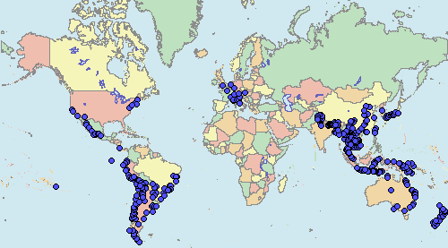
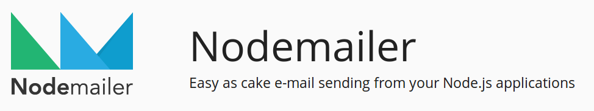

<style>
pre strong { color: black; }
pre { color: #789; }
</style>

# Node.js + Email


## About Me

<br>
<center style="font-size: 50px">
Matt Kopala
<br>
<br>
[@mkopala](http://twitter.com/#!/mkopala)
<br>
<br>
[http://mattkopala.com](http://mattkopala.com)
</center>


## Microprocessor Designer

<div style="float: right">

Credit: http://www.logan.com/sun/opteron/
</div>

Implementation & EDA at AMD

* Verilog
* Perl, Tcl/TK


## World Travel



Backpacked around the world for 3.5 years

* Oct 2002 - April 2006
* PHP, MySQL

http://mytravelpages.net/matt/

* site is old and SLOW


## Freelance & Consulting

<div style="float: right">

Credit: http://geekyduck.com/tag/freelance
</div>

* node.js, 
* CoffeeScript
* MongoDB, MySQL


## TaskBump


Founder of TaskBump 

* node.js
* CoffeeScript
* MongoDB
* jQuery
* Backbone

<center style="font-size: 50px">
https://taskbump.com
</center>


# Overview 


## Slides

Created with [Markdown](http://en.wikipedia.org/wiki/Markdown) and (a hacked version of) [Bedecked](https://github.com/jtrussell/bedecked)

All **code examples** extracted from working scripts/files

* available on GitHub: https://github.com/mkopala/node-email-talk

Error handling is **minimal** or **non-existant**

* to keep things short
* because I was too lazy to add it

Disclaimers

* I'm <b>not an expert</b> on any of this stuff!


## Goals

* Cover basic concepts of email for threading & replies
* Show how to handle email with node
* Provide access to actual working example code


## Survey

How many of you have:

- sent email with node.js?
- processed email with node.js?
    - IMAP
    - save file
    - raw SMTP
- used transaction email (SES, Gmail, Mailgun, Mandrill)


## Email headers

`Message-ID`

* Unique identifier for message.  
* Generated by mailer or SMTP service.

`In-Reply-To`

* Only present in email replies
* Used to link email messages together 

`References`

* Message IDs for previous email in this thread

See: http://en.wikipedia.org/wiki/Email#Header_fields


# Sending Email


## NodeMailer


<p style="height: 40px"></p>

NodeMailer - http://www.nodemailer.com/

    npm install nodemailer

The same author (Andris Reinman) has written these other **node.js** email-related modules:

* simplesmtp
* mail-parser
* mimelib

The example code uses these ...


## Send a message

```
// Set up the SMTP mailer
var nodemailer = require('nodemailer');
var opts = {
	host: '127.0.0.1',
	port: 8300
};
var transport = nodemailer.createTransport("SMTP", opts);

// Construct the email
var email = {
	to: 'Bob <bob@example.com>',
	from: 'Alice <alice@example.com>',
	subject: "Test Message",
	text: "Hello!\n\nThis is my email message.",
};

// Send the Email
transport.sendMail(email, function(err, status) {
	console.log(err, status);
	process.exit();
});
```


# Outgoing Email


## Email DB Schema

Basic **Mongoose DB** schema in `schema.js`:

```
var mongoose = require('mongoose');
var Schema = mongoose.Schema;
var Mixed = Schema.Types.Mixed;
var ObjectId = Schema.Types.ObjectId;

var dbname = 'emaildb';

var EmailSchema = new Schema({
	to: Mixed,
	from: Mixed,
	subject: String, 
	messageId: String,
	inReplyTo: String,
	thread: ObjectId,
	created: { type: Date, default: Date.now }
});

mongoose.connect('mongodb://localhost/' + dbname);

exports.Email = mongoose.model('Email', EmailSchema);
```
See: http://mongoosejs.com/docs/guide.html


## DB Indexes

Let's add a few indexes, for `msgid` and `thread`:

<pre>
var EmailSchema = new Schema({
	to: Mixed,
	from: Mixed,
	subject: String,
	<strong>msgid: {
		type: String,
		index: true
	},
	thread: {
		type: ObjectId,
		index: true,
	},</strong>
	created: { type: Date, default: Date.now }
};
</pre>


## Mailer Module

Wrap up our **NodeMailer** code into `emailer.js`:

```
var nodemailer = require('nodemailer');
var opts = {
	host: '127.0.0.1',
	port: 8300
};
var transport = nodemailer.createTransport("SMTP", opts);

module.exports = transport;
```


## Send & Save to DB

Send the message & save the `Message-ID`:

```
var mongoose = require('mongoose');
var schema = require('./schema');
var Email = schema.Email;
var mailer = require('./emailer');

// Construct the email
var obj = {
	to: 'Bob <bob@example.com>',
	from: 'Alice <alice@example.com>',
	subject: "Test Message",
	text: "Hello!\n\nThis is my email message.",
};

// Send it
mailer.sendMail(obj, function(err, status) {
	// FIXME: Add some error handling ...

	// Create the DB object, set the Message-ID, and save it
	<strong>var email = new Email(obj);
	email.msgid = status.messageId;
	email.thread = new ObjectId;
	email.save(function(err) {
		console.log("Saved new email to DB");
		process.exit()
	});</strong>
});
```


## Check MongoDB collection

Check for our email object in MongoDB:

```
$ mongo emaildb
MongoDB shell version: 2.4.10
connecting to: emaildb
> db.emails.find().forEach(printjson) 
{
	"msgid" : "1402446996892.af4a271f@Nodemailer",
	"to" : "Bob <bob@example.com>",
	"from" : "Alice <alice@example.com>",
	"subject" : "Test Message",
	"_id" : ObjectId("5397a4943204af365d000001"),
	"created" : ISODate("2014-06-11T00:36:36.928Z"),
	"__v" : 0
}
```


# Receiving Email


## SMTP with node.js

We can use **simplesmtp** to set up a simple SMTP server with node:
```
var port = 8300;
var simplesmtp = require('simplesmtp');

function handleReq(req) {
  // Interesting mail handling code ...	
  console.log(req);
  
  req.accept()
}

server = simplesmtp.createSimpleServer({}, handleReq);
server.listen(port, function() {
  console.log("Email server running on port " + port);
});
```


## Email body handling

Let's actually parse the email this time ...
<pre>
var port = 8300;
var simplesmtp = require('simplesmtp');
var MailParser = require("mailparser").MailParser;

function handleReq(req) {
	// Interesting mail handling code ...	
	<strong>var mailparser = new MailParser();
	mailparser.on('end', function(mail) {
		console.log(mail);
		req.accept();
	});
	req.pipe(mailparser);</strong>
}

server = simplesmtp.createSimpleServer({}, handleReq);
server.listen(port, function() {
  console.log("Email server running on port " + port);
});
</pre>


## Module Summary

<br>

### simplesmtp &rarr; <span style="color: gray">SMTP server, protocol</span>

<br>

### mailparser &rarr; <span style="color: gray">handles the actual message, MIME, encoding</span>


## SMTP Session

<div class="slide">
<pre>
$ telnet localhost 8300
Trying 127.0.0.1...
Connected to localhost.
Escape character is '^]'.
220 platypus ESMTP node.js simplesmtp
HELO example.org
250 platypus at your service, [127.0.0.1]
MAIL FROM: <alice@example.com>
250 2.1.0 Ok
RCPT TO: <bob@example.com>
250 2.1.0 Ok
DATA
354 End data with <CR><LF>.<CR><LF>
From: alice.example.com
To: bob@example.com
Subject: Test Message

This is a test
.
250 2.0.0 Ok: queued as 3bf1c3a2ea225fb36f49
quit
221 2.0.0 Goodbye!
Connection closed by foreign host.
</pre>
</div>
See: http://en.wikipedia.org/wiki/SMTP#SMTP_transport_example


## Domain/User Validation

Reject emails that aren't addressed to us.
<pre>
function handleReq(req) {
	// Assuming one recipient, for simplicity's sake
	recipient = req.to[0];
	<strong>
	// Check the domain of the recipient
	if (!recipient.match(/@mydomain\.com$/)) {
		console.log("Invalid recipient: " + recipient);
		req.reject("Invalid recipient domain");
	}</strong>
}
</pre>
We could also check the part before the `@`, and/or look up users in a database.


## Examples

Send a simple message, show the JSON for the SMTP exchange

* `send-email-1.js` + `server-1.js`

Send a simple message, show the JSON for the message body

* `send-email-1.js` + `server-2.js`

Send a simple message, reject using domain validation

* `send-email-1.js` + `server-5.js`


# Other Options


## Gmail + IMAP/POP3

Not specific to Gmail - could be any mail service w/ IMAP or POP3 support

* might be more robust than relying on your node.js application to handle SMTP

See: https://github.com/mscdex/node-imap


## Postfix + Dovecot

### ... i.e. running your own mail + IMAP server.

<br>

I'm going to skip this one ...  But a couple of thoughts on it:

* more complicated - two extra serves, both requiring configuration
* same code as using an email service with IMAP


# Replies


## Send a reply

A simple script to reply to an email:

<pre><code>
var mailer = require('./emailer');

// Construct the email
var obj = {
	to: 'Bob <bob@example.com>',
	from: 'Alice <alice@example.com>',
	subject: "Test Message",
	text: "Hello!\n\nThis is my email message.",
	<strong>inReplyTo: process.argv[2]</strong>
};

// Send the reply
mailer.sendMail(obj, function(err, status) {
	console.log("Sent reply");
	process.exit()
});
</code></pre>

Example usage:

    node send-reply.js 1402449977942.3aed41b7@Nodemailer 


## Saving the Reply

<pre>
function handleReq(req) {
	// Interesting mail handling code ...	
	var mailparser = new MailParser();
	mailparser.on('end', function(mail) {
		<strong>
		// Look up the original message
		query = { messageId: mail.inReplyTo };
		Email.findOne(query, function(err, orig) {
			if (err || orig == undefined) {
				console.error("Could not find original email");	
				return req.reject()
			}
			// Save the reply, with the thread set	
			reply = new Email(mail);
			reply.thread = orig.thread;

			reply.save(function(err) {
				console.log("Saved reply to DB");
				req.accept();
			})
		});</strong>
	});
	req.pipe(mailparser);
}
</pre>


# Attachments


## Outgoing emails


## Incoming emails


# Email forwarding


## Envelope Sender

Change the actual recipient in the **SMTP Envelope**.

<pre>
email = {
    from: "alice@example.com",
    to: "replies@example.com",
    <strong>envelope: {
        to: "bob@example.com"
    }</strong>
}
</pre>

See:

* [Email forwarding - Wikipedia](http://en.wikipedia.org/wiki/Email_forwarding)
* [Bounce address - Wikipedia](http://en.wikipedia.org/wiki/Bounce_address)


## Bouncing the message

<pre>
function handleReq(req) {
	// Prevent recursion for this contrived example ...
	if (req.to[0] === 'charlie@example.com') {
		console.log("Got message for charlie");
		return;
	}

	// Interesting mail handling code ...	
	var mailparser = new MailParser();
	mailparser.on('end', function(mail) {
		<strong>// Forward the message
		mail.envelope = {
			to: "charlie@example.com"
		};

		mailer.sendMail(mail);
		</strong>
		console.log("Forwarded message to charlie");

		req.accept();
	});
	req.pipe(mailparser);
}
</pre>


# DevOps


## Running on SMTP ports

Make it easy on ourselves, and increase availability

* keep `node` running & listening on a non-privileged port
* let `haproxy` direct your SMTP traffic to your node process(es)

Example **HAProxy** config:

```
listen smtp 127.0.0.1:25
	mode tcp
	balance roundrobin
	server smtp1 127.0.0.1:8300 check
	server smtp2 127.0.0.1:8301 check
```
See: http://www.linickx.com/645/load-balance-anything-with-haproxy


## Spam

- Gmail, forwarding
- Spam Assassin
- other...?


# Other


## Mailin


http://mailin.io


## Haraka


http://haraka.github.io/


# End / Questions?


